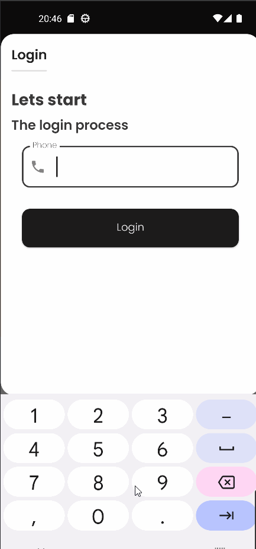

# Appointments

#### Just for fun , Still in development

 

## Project Overview

This is a client appointments app mainly for a barber shop managment .

## What I Used

- Fully Compose UI
- Kotlin
- Dependency Injection with Hilt
- Retrofit
- Coil
- DataStore
- MVVM
- Unidirectional data flow

## Some fetuers

- Booking appointment
- unbook appointment
- appointment status
- profile
- login and signup
- Auto refresh token
- Navigation to login on 401 code (only occurs when refresh token is expired )

 

 

## Authors

**Tarik Husin**  - linkedin -> https://www.linkedin.com/in/tarik-husin-706754184/

